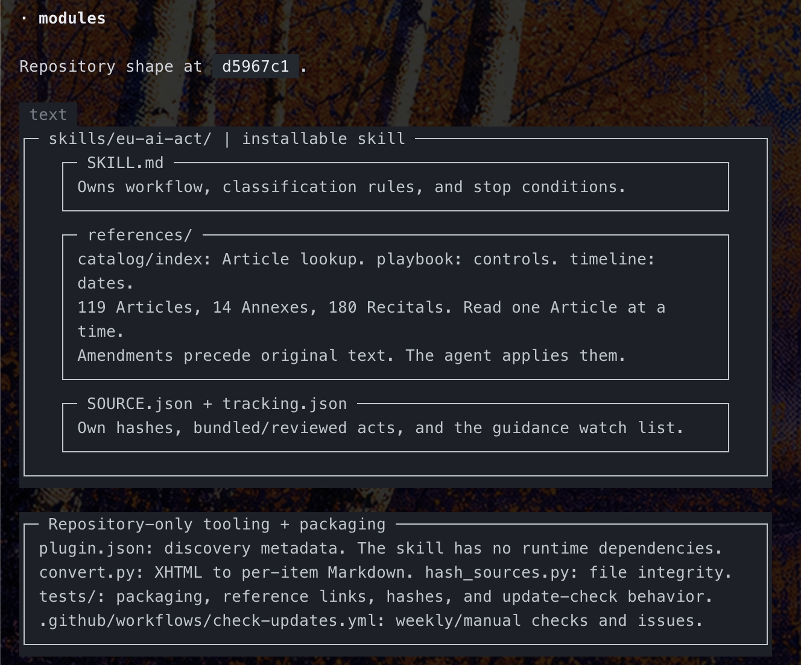
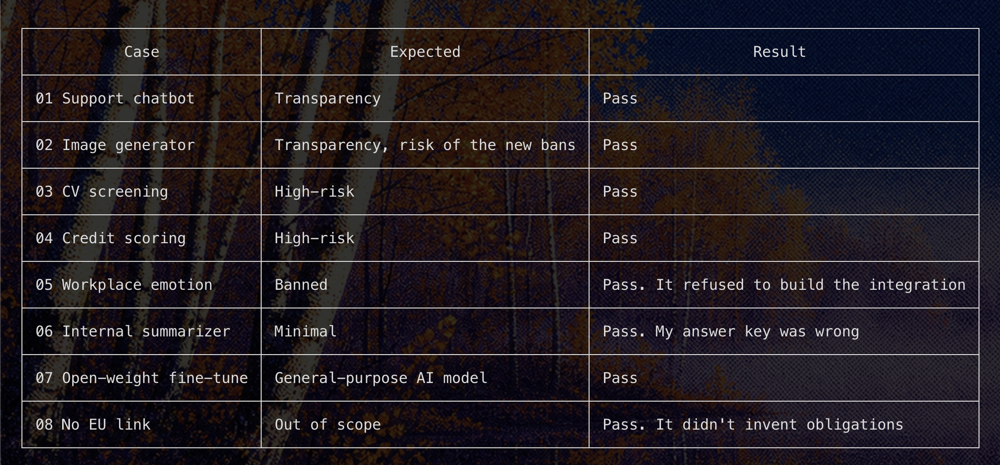

# eu-ai-act

An agent skill that helps builders and their coding agents ship EU AI Act
compliant software. The agent classifies each AI feature against the official
text, then turns the obligations that apply into code, tests, and docs.

Covers Regulation (EU) 2024/1689 (AI Act) as amended by Regulation (EU)
2026/1744 (Digital Omnibus on AI, in force 27 July 2026).

Engineering guidance, not legal advice.

## What the agent does

1. Establishes facts: AI call sites, intended purpose, role (provider,
   deployer, ...), model sources, EU nexus.
2. Classifies: scope, prohibited practices (Art. 5), high-risk (Art. 6,
   Annexes I and III), transparency (Art. 50), general-purpose AI models
   (Arts. 51-56), AI literacy (Art. 4).
3. Maps each obligation to a control with the builder playbook.
4. Implements controls with tests that fail on regression.
5. Reports an obligation register with Article citations and dates.

## Layout




The installable skill is `skills/eu-ai-act/`:

- `SKILL.md`: workflow and rules.
- `references/catalog.md`: questions to Articles.
- `references/builder-playbook.md`: obligations to engineering controls.
- `references/timeline.md`: application dates as amended.
- `references/index.md`: every Article and Annex, amended ones marked.
- `references/articles/NNN.md`, `annexes/<roman>.md`, `recitals/NNN.md`:
  official text, one item per file. Files changed in 2026 open with the
  amending text quoted verbatim, then the 2024 text.
- `SOURCE.json`: source documents and per-file hashes.
- `tracking.json`: acts already bundled or reviewed, and the guidance watch list.

Maintenance lives at the repository root: `scripts/` (convert, hash, check
for updates), `tests/`, and the weekly update workflow.

One Article costs roughly 0.5k to 5k tokens to load.

## Install

1. **With the [Skills CLI](https://github.com/vercel-labs/skills):**

   ```sh
   npx skills add superuserkalo/eu-ai-act --skill eu-ai-act
   ```

2. **Copy the complete skill directory into your agent's skill root:**

   ```sh
   git clone https://github.com/superuserkalo/eu-ai-act.git
   mkdir -p ~/.agents/skills
   cp -R eu-ai-act/skills/eu-ai-act ~/.agents/skills/
   ```

   `~/.agents/skills` is an example shared skill root. Use your client's supported
   location if it differs, such as `~/.claude/skills` for Claude Code. Keep the
   `references/` directory alongside `SKILL.md`.

Or simply tell your agent to install the skill from
[this GitHub repository](https://github.com/superuserkalo/eu-ai-act).

The repository also includes a root `plugin.json` for Agent Plugins-compatible
clients. The skill itself needs no runtime dependencies.

## Verify

```sh
python3 -m unittest discover -s tests -v
```

## Evals

`evals/` holds scenario tests. Each case in `evals/cases/` goes to a fresh
agent that has only the skill, with no web access and no view of the answer
key (`evals/expected.json`). Reports land in `evals/runs/<date>/` and are
graded against the key. The first run on 2026-10-01 passed all 8 cases:



For case 06 the agent was right and the answer key was wrong: Article 50(2)
marking also applies to internal tools. The key is corrected. See
[`evals/README.md`](evals/README.md) for per-case notes, untested areas, and
how to rerun.

## Staying current

A GitHub Action (`.github/workflows/check-updates.yml`) runs every Monday and
on demand. It runs `scripts/check_updates.py`, which:

- asks the EU Publications Office for every act that amends, corrects,
  implements, or proposes to amend the bundled text, and reports any not in
  `tracking.json`. Corrections count only when an English version exists.
- reports watch-list pages (guidelines, codes of practice, standards) that
  fail to load or were last reviewed more than 90 days ago.

When it finds something, it opens or comments on one issue titled
"AI Act update check: action needed".

To bundle a new amending act or English correction:

```sh
curl -sL -H "Accept: application/xhtml+xml" -H "Accept-Language: eng" \
  https://publications.europa.eu/resource/celex/<CELEX> > new.xhtml
python3 scripts/convert.py act.xhtml skills/eu-ai-act/references omnibus.xhtml new.xhtml  # oldest first
python3 scripts/hash_sources.py
python3 -m unittest discover -s tests -v
```

Then update `references/timeline.md` and the playbook if dates or duties
changed, add the act to `bundled` in `skills/eu-ai-act/tracking.json` and to
`documents` in `skills/eu-ai-act/SOURCE.json`, and commit. For anything that needs no text change, add it to
`reviewed` with a one-line reason. After reviewing a watched page, set its
`last_reviewed` date.

## Sources and reuse

Project-authored files are MIT licensed (see `LICENSE`). EU legal text
© European Union, https://eur-lex.europa.eu/, reused under Commission Decision
2011/833/EU. Only the Official Journal is authentic. See
`skills/eu-ai-act/NOTICE.md`.
